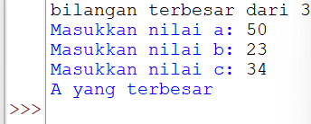
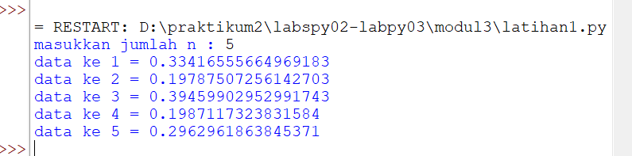
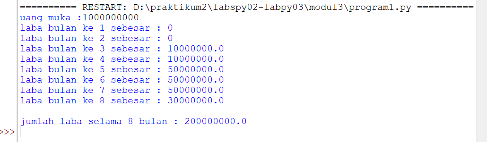

# Algoritma Menentukan Nilai Terbesar Dari 3 Buah Bilangan

1. Mulai
2. Inisiasi bil1,bil2,bil3 sebagai integer.
3. Baca bil1.
4. Baca bil2.
5. Baca bil3.
6. Jika bil1 > bil2 dan bil1 > bil3 maka kerjakan langkah 8, selain itu
7. Jika bil2 > bil1 dan bil2 > bil3 maka kerjakan langkah 9, selain itu kerjakan langkah 10.
8. Cetak “Bilangan Terbesar Bilangan Pertama”.
9. Cetak “Bilangan Terbesar Bilangan Kedua”.
10. Cetak “Bilangan Terbesar Bilangan Ketiga”.
11. Selesai

Untuk Flowchart nya bisa dilihat pada gambar di bawah ini :

Berikut adalah contoh outputnya :

## Program Untuk Menampilkan N Bilangan Acak Yang Lebih Kecil Dari 0.5
==> Urutan Pembuatan Program

1. Ketikan Program print ('Tampilkan n Bilangan Acak yang Lebih Kecil Dari 0.5')
2. Ketikan Program jumlah=int(input("Masukan Jumlah N : "))
3. Ketikan Program import random
4. Ketikan Program for i in range ( jumlah ) :
5. Ketikan Program print("Data ke", 1+i,"=>", (random.uniform(0.1,0.5))

==> Penjelasan Alur Program

1. print ('Tampilkan n Bilangan Acak yang Lebih Kecil Dari 0.5') Untuk Menampilkan atau Mencetak kalimat Tampilkan N Bilangan Acak yang Lebih Kecil Dari 0.5

2. jumlah=int(input("Masukan Jumlah N : ")) Untuk menentukan jumlah input yang di inginkan sesuai tipe data yaitu interger tipe data bilangan bulat

3. import random*

4. for i in range ( jumlah ) : Untuk Pengulangan dengan range jumlah

5. print("Data ke", 1+i,"=>", (random.uniform(0.1,0.5))) Untuk menampilkan atau mencetak urutan data sesuai jumlah inputan dengan hasil di bawah 0.5

Berikut adalah hasilnya :

### menampilkan bilangan terbesar dari n buah data yang diinputkan.Masukkan angka 0 untuk berhenti.

1. Mulai

2. integer max = 0

3. Menggunakan fungsi perulangan while true, hingga menampilkan perulangan sampai batas tertentu.

4. Memasukan bilangan integer pada "a"

5. Menggunakan fungsi if jika max kurang dari nilai a, maka max sama dengan a

6. Mengunakan fungsi if jika nilai a adalah 0 maka fungsi break artinya perulangan berhenti jika menulis nilai 0.

7. Mencetak nilai paling terbesar setelah break, sehingga menampilkan nilai terbesar diantara bilangan tersebut dalam perulangan.

8. Selesai

Berikut adalah hasilnya :

[gambar4](picture/pic4.png)

#### Program Untuk Menghitung Jumlah Laba Hasil Investasi Seorang Pengusaha Selama 8 Bulan

==> Urutan Pembuatan Program

1. Ketikan Program print ('Jumlah Laba Hasil Investasi Seorang Pengusaha Selama 8 Bulan')
2. Ketikan Program x=100000000
3. Ketikan Program print (" Modal Awal:",x)
4. Ketikan Program a=0x, b=0x, c=0.01x, d=0.01x, e=0.05x, f=0.05x, g=0.05x, h=0.03x
5. Ketikan Program y=[a ,b,c,d,e,f,g,h]
6. Ketikan Program For i in range (len (y))
7. Ketikan Program Print (“laba bulan ke-“,i+1,”sebesar:” ,y[i])
8. Ketikan Program Z= (a+b+c+d+e+f+g+h)
9. Ketikan Program Print (“jumlah laba selama 8 bulan adalah:”)

==> Penjelasan Alur Program

1. print ('Jumlah Laba Hasil Investasi Seorang Pengusaha Selama 8 Bulan') Untuk Menampilkan kalimat Jumlah Laba Hasil Investasi Seorang Pengusaha Selama 8 Bulan

2. x=100000000 Dengan pemisalan atau dideklarasikan x adalah 100000000

3. print (" Modal Awal:",x) Menampilkan kalimat Modal Awal : dan data yang berisi di x yaitu 100000000

4. a=0x, b=0x, c=0.01x, d=0.01x, e=0.05x, f=0.05x, g=0.05x, h=0.03x Untuk Mendeklarasikan presentase laba tiap bulan dan di kali dengan x atau data inputan modal investasi yaitu 100000000

5. y=[a,b,c,d,e,f,g,h ] untuk menentukan syarat y= yang berisi a,b,c,d,e,f,g,h

6. For i in range (len (y)) Print (“laba bulan ke-“,i+1,”sebesar:” ,y[i ]) untuk perulangan data dengan isi data yaitu Ydengan menampilkan urutan laba perbulan sesuai range yang di tentukan dengan hasil ke untukan yang di inpput dari data Y

7. Z= (a+b+c+d+e+f+g+h) Print (“jumlah laba selama 8 bulan adalah:”) Z berisi data penjumlahan data angka yang ada didalam kode a,b,c,d,e,f,g,h yang akan di tampilakan atau dicetak di jumlah laba selama 8 bulan.

Berikut adalah hasilnya :

